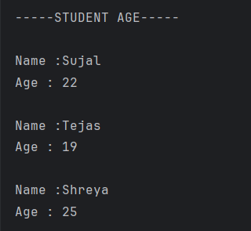

# Student Age Sorting in Java

This project demonstrates how to create a `Student` class and sort a list of students by their age in **descending order** using a `Comparator` in Java.

---

## 📂 Files
- `Student.java` — Defines the `Student` class with `name` and `age` fields.  
- `Main.java` — Demonstrates adding `Student` objects to a list and sorting them by age using a `Comparator`.

---

## 🧠 Concept Used
- **Classes and Objects** — Creating custom `Student` objects.  
- **ArrayList** — Storing multiple `Student` objects.  
- **Comparator** — Custom sorting of objects.

---

## 📸 Screenshot

---

## 👨‍💻 Author
**Sujal Patil**  
📧 Email: sujalpatil21@gmail.com  
🌐 GitHub: [SujalPatil21](https://github.com/SujalPatil21)
