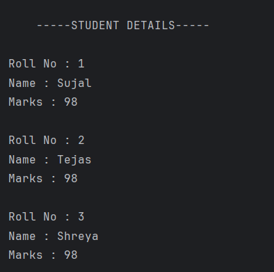

# Student Details  

A simple Java program that demonstrates the use of **classes, objects, constructors, and the `this` keyword** in Java.  
The program stores and displays details of students such as **roll number, name, and marks**.  

---

## Features  
- Defines a **StudentM class** with:  
  - Roll number  
  - Name  
  - Marks  
- Uses a **constructor** to initialize student details.  
- Uses the **`this` keyword** to refer to instance variables.  
- Displays details of multiple students using the `display()` method.  

---

## How to Run  
1. Open the project in any Java IDE (IntelliJ, Eclipse, VS Code) or terminal.  
2. Compile and run `Student.java`.  
3. The program will automatically display the details of three students:  
   - Roll No  
   - Name  
   - Marks  

---

## Screenshot

---

## Author  
- **Sujal Patil**  
- **GitHub**: [SujalPatil21](https://github.com/SujalPatil21)  
- **Email**: sujalpatil21@gmail.com  
