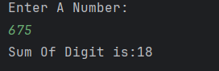

# Sum of Digits Calculator

A simple Java program that calculates the **sum of digits** of a given number using loops.

---

## Features
- Accepts an integer input from the user  
- Extracts each digit using the modulus operator (`%`)  
- Calculates the sum of all digits  
- Displays the result  

---

## Screenshot

---

## Author
- **Sujal Patil**  
- **GitHub**: [SujalPatil21](https://github.com/SujalPatil21)  
- **Email**: sujalpatil21@gmail.com  
