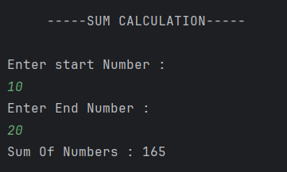

# Sum of Numbers (Using For Loop)

A simple Java program that calculates the **sum of numbers** between a given **start** and **end** range entered by the user.  

---

## 🧮 Features
- Takes **start** and **end** numbers as user input.  
- Uses a **for loop** to calculate the sum of all numbers in the given range.  
- Demonstrates basic **looping** and **accumulator** concept in Java.  
- Uses the **Scanner class** for user input.  

---

## ⚙️ How to Run
1. Open the project in any Java IDE (IntelliJ, Eclipse, VS Code) or use the terminal.  
2. Compile and run the file:  
   ```bash
   javac Sum.java
   java Sum


---

## Output


---

## Author
- **Sujal Patil**  
- **GitHub**: [SujalPatil21](https://github.com/SujalPatil21)  
- **Email**: sujalpatil21@gmail.com  

