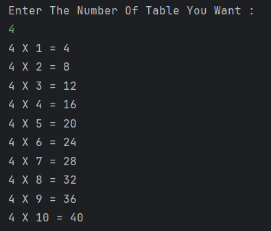

# Table Calculator

A simple Java program to **print the multiplication table** of a given number.  
The user provides a number, and the program displays its table from 1 to 10.

---

## Features
- Accepts a number as input from the user  
- Uses a loop to generate the multiplication table  
- Displays results clearly in `n x i = result` format  

---

## How to Run
1. Open the project in any Java IDE (IntelliJ, Eclipse, VS Code) or terminal.  
2. Compile and run `Table.java`.  
3. Enter the number for which you want the multiplication table.  
4. The program will display the table from 1 to 10.  

---

## Screenshot

---

## Author
- **Sujal Patil**  
- **GitHub**: [SujalPatil21](https://github.com/SujalPatil21)  
- **Email**: sujalpatil21@gmail.com
