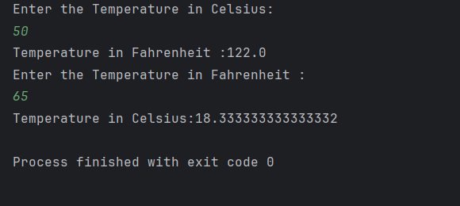

# 🌡️ Temperature Converter (Java)

A beginner-friendly Java project that converts temperatures between **Celsius** and **Fahrenheit**.  
It accepts user input using the **Scanner** class and displays the converted result.

---

## 🚀 Features
- Convert **Celsius → Fahrenheit**
- Convert **Fahrenheit → Celsius**
- Interactive user input
- Beginner-friendly code structure

---

## 📘 Formula
- Celsius to Fahrenheit:  
  `F = (C × 9/5) + 32`
- Fahrenheit to Celsius:  
  `C = (F − 32) × 5/9`

---

## 📸 Screenshot

## Author
- **Sujal Patil**  
- **GitHub**: [SujalPatil21](https://github.com/SujalPatil21)  
- **Email**: sujalpatil21@gmail.com  
