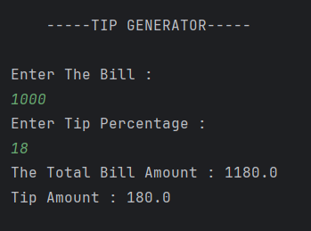

# Tip Generator

A simple Java program that calculates the **tip** and **total bill amount** based on user input.  

---

## Features
- Calculates the **tip amount** based on the bill and tip percentage.  
- Calculates the **total bill amount** including the tip.  
- Simple and easy-to-use command-line interface.  

---

## How to Run
1. Open the project in any Java IDE (IntelliJ, Eclipse, VS Code) or terminal.  
2. Compile and run `Tip.java`.  
3. Enter values for:
   - Bill amount  
   - Tip percentage  
4. The program will display:
   - Tip amount  
   - Total bill amount including tip  

---

## Output

---

## Author
- **Sujal Patil**  
- **GitHub**: [SujalPatil21](https://github.com/SujalPatil21)  
- **Email**: sujalpatil21@gmail.com  
