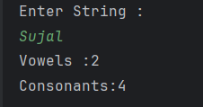

# Vowels and Consonants Counter

A simple Java program that counts the number of **vowels** and **consonants** in a given string.  

---

## Features
- Accepts a string input from the user  
- Converts the string to lowercase for easy comparison  
- Counts the number of vowels (`a, e, i, o, u`)  
- Counts all other characters as consonants  
- Displays the total count of vowels and consonants  

---

## How It Works
1. User enters a string.  
2. Program iterates through each character of the string.  
3. If the character is a vowel (`a, e, i, o, u`), it increases the **vowel count**.  
4. Otherwise, it increases the **consonant count**.  
5. Finally, the program prints the number of vowels and consonants.  

---

## Screenshot

---

## Author
- **Sujal Patil**  
- **GitHub**: [SujalPatil21](https://github.com/SujalPatil21)  
- **Email**: sujalpatil21@gmail.com  
